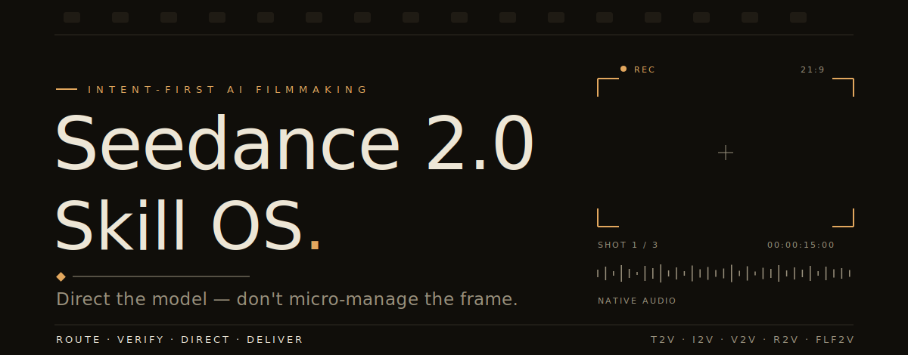
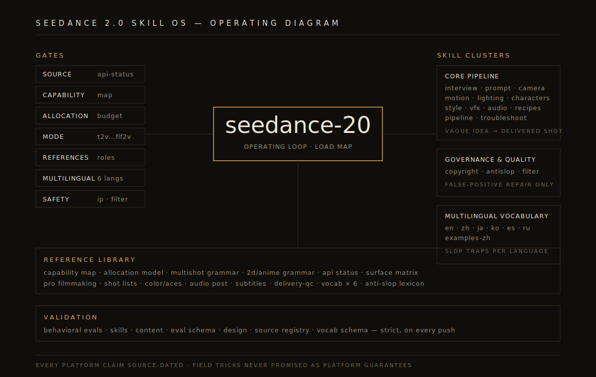
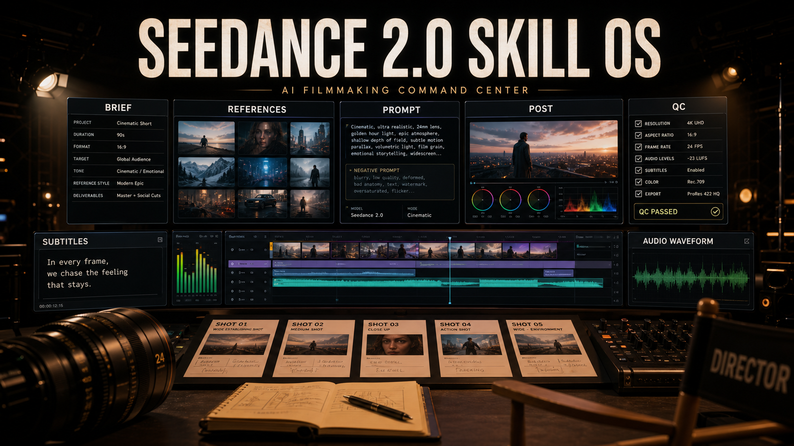
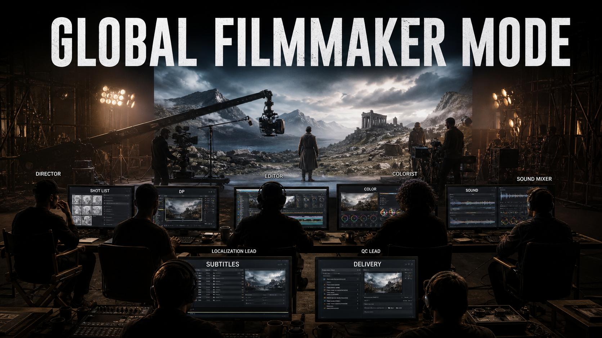
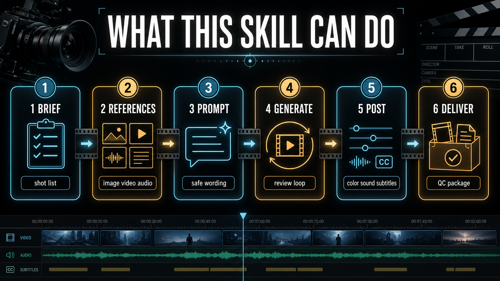
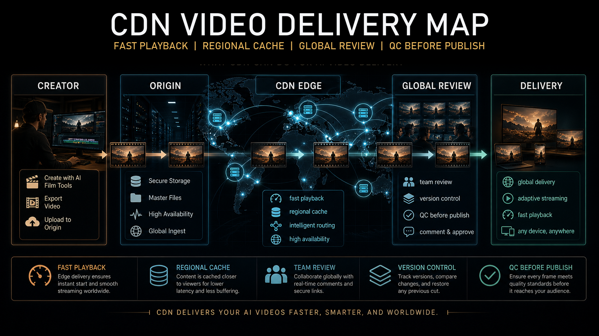
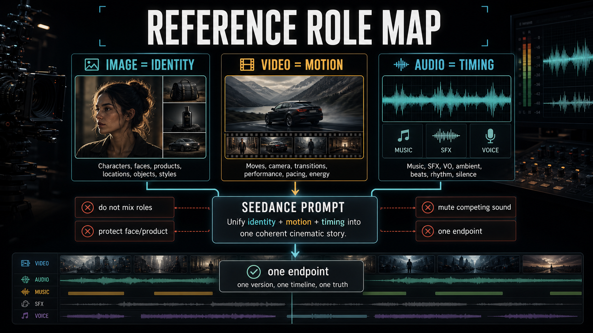
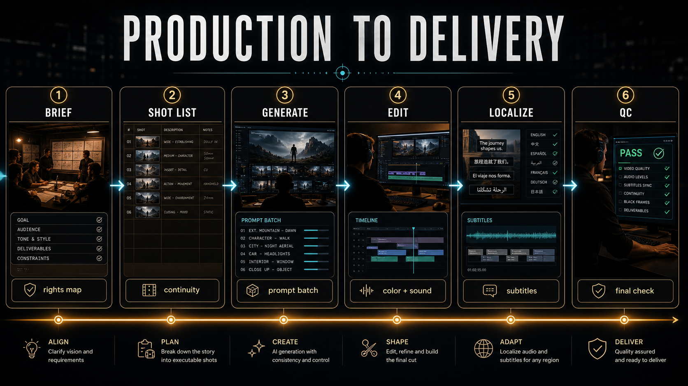
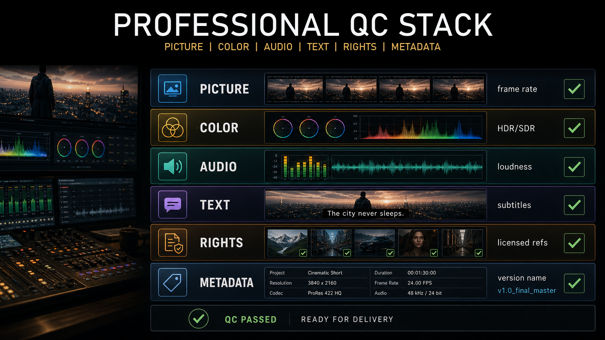

<div align="center">

<picture>
  <source media="(prefers-color-scheme: dark)" srcset="assets/hero-dark.svg">
  <source media="(prefers-color-scheme: light)" srcset="assets/hero-light.svg">
  
</picture>

# Seedance 2.0 Skill OS

**Direct the model. Don't micro-manage the frame.**

An agent that directs Seedance 2.0 like a filmmaker — reading each scene before it writes the prompt.<br>Text, image, video, and reference to video with native audio, IP-safe rewrites, source-dated platform facts, and native reader paths for English, 中文, 日本語, and 한국어.

[](#changelog)
[](#skill-map)
[](#reference-library)
[](#validation)
[](LICENSE)

[Start here](#start-here) · [Skill map](#skill-map) · [Reference library](#reference-library) · [Visual gallery](#visual-gallery) · [Install](#install)

English · [中文](docs/README.zh.md) · [日本語](docs/README.ja.md) · [한국어](docs/README.ko.md)

</div>

Author: [Iamemily2050 (@iamemily2050)](https://github.com/Emily2040) · [Instagram](https://instagram.com/iamemily2050) · [X](https://x.com/iamemily2050) · [Website](https://iamemily2050.com)

Platform context: [ByteDance Seedance 2.0](https://seed.bytedance.com/en/seedance2_0) · Dreamina · Jimeng · Doubao · [Volcengine Ark](https://www.volcengine.com/docs/82379/2291680?lang=zh) · [BytePlus ModelArk](https://docs.byteplus.com/en/docs/ModelArk/2291680) · [Runway Seedance 2](https://docs.dev.runwayml.com/guides/models/) · fal · provider/router surfaces tracked in [`platform-surface-matrix.md`](references/platform-surface-matrix.md)

Updated: **2026-07-06** · **v6.6.0 the loop closes: frame-extraction observation tooling, state lifecycle for long projects, and the worked end-to-end trace** · plus native quickstarts in six languages, a security policy, and an expanded agent-install matrix

---

## Direct the scene, don't decorate it

Most tools ask the model for a "cinematic look." A director asks what the scene is *doing* — then makes the camera, lens, light, blocking, performance, and sound all serve one intention, in a single recognizable voice, across an entire story.

The [**directing engine**](references/directing-engine.md) encodes that judgment. It reads a scene's dramatic function — the turn, the point of view, the power, the subtext — names one intention, and derives a coherent setup instead of stacking adjectives.

**Ask for "cinematic":** `epic cinematic shot of a woman reading a letter, emotional, beautiful lighting`

**Direct it:** `Medium close-up, eye-level; she lowers the letter and her hands go still as a slow push-in arrives; soft window light behind her keeps her face plain; near-silence with one chair scrape — the realization lands in the stilled hands, not a word.`

It then holds one directorial voice across every short clip of a long story, and ships with **33 worked derivations** — product, music video, horror, anime, action, comedy, documentary, high fashion, sci-fi, and more — each shown end to end.

> A reveal is not lit, framed, blocked, or performed like a goodbye. The engine refuses the generic answer and derives the specific one.

## Native Language Start / 多语言入门 / 多言語スタート / 다국어 시작

Seedance 2.0 Skill OS is English-readable, but the v6 line gives Chinese, Japanese, and Korean readers first-class entry points, active example skills, and native prompt guidance. Keep reference tags exactly as written (`@Image1`, `@Video1`, `@Audio1`, `@图片1`, `@视频1`) in every language.

| Language | Start path | Native reader note |
|---|---|---|
| English | [`seedance-prompt`](skills/seedance-prompt/SKILL.md), [`seedance-sequence`](skills/seedance-sequence/SKILL.md), [`references/vocab/en.md`](references/vocab/en.md) | Use precise production English: one visible beat, one camera move, real light, and clear reference roles. |
| 中文 | [`中文指南`](docs/README.zh.md), [`seedance-vocab-zh`](skills/seedance-vocab-zh/SKILL.md), [`seedance-examples-zh`](skills/seedance-examples-zh/SKILL.md), [`references/vocab/zh.md`](references/vocab/zh.md) | 中文用户可从角色锁定、首尾帧、运镜、动作节奏开始；提示词要短、具体、保留参考标签，不把字幕交给模型生成。 |
| 日本語 | [`日本語ガイド`](docs/README.ja.md), [`seedance-vocab-ja`](skills/seedance-vocab-ja/SKILL.md), [`seedance-examples-ja`](skills/seedance-examples-ja/SKILL.md), [`references/vocab/ja.md`](references/vocab/ja.md) | 日本語では、人物の同一性、衣装、構図、動きの終点を明確に書き、字幕や広告コピーは後処理で追加します。 |
| 한국어 | [`한국어 가이드`](docs/README.ko.md), [`seedance-vocab-ko`](skills/seedance-vocab-ko/SKILL.md), [`seedance-examples-ko`](skills/seedance-examples-ko/SKILL.md), [`references/vocab/ko.md`](references/vocab/ko.md) | 한국어 프롬프트는 인물 고정, 카메라 움직임, 조명, 사운드를 짧게 분리하고 자막과 문구는 편집 단계에서 넣습니다. |

New here? Each language also has a 5-minute quickstart: [English](docs/QUICKSTART.md) · [中文](docs/QUICKSTART.zh.md) · [日本語](docs/QUICKSTART.ja.md) · [한국어](docs/QUICKSTART.ko.md) · [Español](docs/QUICKSTART.es.md) · [Русский](docs/QUICKSTART.ru.md).

For longer stories in any language, start with [`seedance-sequence`](skills/seedance-sequence/SKILL.md). For the next part of an accepted clip, use [`seedance-continuation`](skills/seedance-continuation/SKILL.md) and update the observed final state before writing the next prompt.

## Why this repository exists

Seedance 2.0 Skill OS is a modular agent-skill package for directing Seedance 2.0 video generations. It is built around a simple principle: **direct the model, do not micro-manage the frame**.

The repository gives an AI assistant a public, auditable operating system for Seedance work. It defines when to interview, when to write a compact prompt, when to load a technical reference, when to rewrite unsafe IP content, and when to troubleshoot a bad generation.

## What This Skill Does

This skill package turns Seedance 2.0 work into a repeatable assistant workflow:

- Routes vague ideas into short creative interviews instead of premature prompt dumps.
- Directs each scene before drafting: reads its dramatic function, sets one directorial voice, and makes camera, light, blocking, performance, and sound serve a single intention instead of a generic "cinematic" look - and holds that voice across every clip of a long story.
- Writes full or compressed prompts for T2V, I2V, V2V, R2V, FLF2V, edit, extend, audio-aware, and first/last-frame workflows.
- Separates every reference asset by role: identity, environment, motion, camera rhythm, audio tempo, style, or endpoint.
- Keeps model and platform claims source-dated so API, pricing, region, quota, and model-ID details are not guessed.
- Plans into model strengths before drafting: a capability map, a fidelity-allocation model, and a working model of the generator's mechanics that explains why every rule works.
- Runs the shoot like a producer after generation: five-verdict take triage, one-variable retakes, attempt budgets, and cost-aware drafting.
- Provides native-reader front-page paths plus deeper multilingual cinematic vocabulary in English, 中文, 日本語, 한국어, Spanish, and Russian, including role binding, first/last-frame phrasing, edit/extend wording, safety wording, audio cues, continuation wording, and post-production text handling.
- Adds original community-informed examples for Chinese, Japanese, Korean, Russian-English, and Spanish-English prompt structures.
- Adds professional filmmaker workflows for treatment-to-shot-list planning, shot contracts, continuity ledgers, ACES/color handoff, audio post, subtitles/localization, aspect-ratio variants, campaign cutdowns, delivery/QC, and client review packets.
- Handles safe false-positive repairs by clarifying benign production context, not by hiding unsafe intent.
- Rewrites unsafe celebrity, protected IP, private-person, brand, logo, song, or voice requests into safer creative equivalents.
- Diagnoses failed outputs with concrete repair levers: camera, lighting, motion, reference role, duration, framing, audio, or safety wording.
- Ships validation scripts, eval cases, source data, and design checks so maintainers can review changes before release.

## Making Videos Longer Than One Generation

Do not blindly ask the skill to extend the original prompt. A continuation must be based on accepted generated footage because Seedance may not end exactly where the original prompt expected.

1. Describe the complete idea and how it ends.
2. The skill divides it into connected clips.
3. Generate Clip 01.
4. Return the generated clip or its final frame.
5. The skill records what actually happened.
6. It writes Clip 02 from the real ending.
7. Repeat until the planned final outcome is reached.

The project state is the source of truth. The clip contract is the current production task. The prompt is a compiled instruction for only that task. Accepted generated footage determines what happens next.

## Professional Filmmaker Scope

This package is designed for working film and commercial teams, not only for casual prompt writing. It can help an agent produce the artifact the role actually needs:

| Role | What the skill should produce |
|---|---|
| Director | treatment, scene beat, performance intent, coverage, shot endpoint, review notes |
| Cinematographer / DP | shot contract, shot size, lens feel, camera support, movement, blocking, lighting continuity |
| Producer / agency | client brief, rights map, approval gates, campaign variants, risk log, review packet |
| Editor | selects plan, edit/extend decision, continuity handoff, handles, textless needs, conform notes |
| Colorist | color intent, ACES-aware handoff, show-look notes, HDR/SDR caveats, product-color checks |
| Sound team | dialogue map, ambience/SFX/music layers, sync cues, stems, M&E, dubbing and loudness notes |
| Localization team | subtitles, SDH captions, forced narratives, dubbing guide, market copy, textless plates |
| Delivery/QC | frame rate, aspect ratio, crop, color, loudness, captions, metadata, naming, human QC checklist |

For these requests, the skill should not stop at a single prompt. It should return the production object first, then the Seedance prompt or prompt batch that fits inside that plan.

## Start Here

| User situation | Load first | Output |
|---|---|---|
| “I have a vague idea.” | [`seedance-interview`](skills/seedance-interview/SKILL.md) | A focused creative brief and next prompt path. |
| “This is a longer story / make it three connected clips.” | [`seedance-sequence`](skills/seedance-sequence/SKILL.md) | Full story spine, continuity bible, sequence map, Clip 01 contract, and Clip 01 prompt only. |
| “Continue this video / make the next part.” | [`seedance-continuation`](skills/seedance-continuation/SKILL.md) | A source-gated continuation from accepted footage or a request for the missing clip/final frame. |
| “I know the scene I want.” | [`seedance-prompt`](skills/seedance-prompt/SKILL.md) | A production-ready Seedance prompt. |
| “Make it actually feel directed, not just cinematic.” | [`directing-engine`](references/directing-engine.md) | One intention per scene, a coherent camera/light/blocking/performance/sound setup, and one directorial voice across the story. |
| “Make it short and strong.” | [`seedance-prompt-short`](skills/seedance-prompt-short/SKILL.md) | A compressed 30–100 word prompt. |
| “I have an image/video/audio reference.” | [`reference-workflow`](references/reference-workflow.md) | A role map for every reference asset. |
| “Use this as first frame and that as final frame.” | [`first-last-frame-guide`](references/first-last-frame-guide.md) | A continuous transition with endpoint locks. |
| “The take is 80% right - regenerate or keep?” | [`retake-protocol`](references/retake-protocol.md) | A triage verdict, the one-variable retake, and an attempt budget. |
| “It failed or looks bad.” | [`seedance-troubleshoot`](skills/seedance-troubleshoot/SKILL.md) | A root-cause diagnosis and repaired prompt. |
| “Why did that happen?” | [`model-mechanics`](references/model-mechanics.md) | The mechanism behind the failure and the lever that works with it. |
| “This uses a character, brand, celebrity, or real person.” | [`seedance-copyright`](skills/seedance-copyright/SKILL.md) | A safer rewrite preserving the creative function. |
| “I need this for a film, client, campaign, or delivery.” | [`pro-filmmaking-standards`](references/pro-filmmaking-standards.md) | A professional workflow plan, role-specific artifact, and prompt path. |
| “Turn this treatment into shots.” | [`shot-list-continuity`](references/shot-list-continuity.md) | Shot list, continuity ledger, and prompt batch structure. |
| “This needs subtitles, dubbing, color, sound, or QC.” | [`delivery-qc`](references/delivery-qc.md) | Post, localization, audio, color, and delivery checks. |
| “I need API, Runway, provider, pricing, model ID, or production workflow guidance.” | [`api-workflow`](references/api-workflow.md) | A source-gated operational checklist. |
| “Is this Seedance Pro/Fast/V2?” | [`model-name-map`](references/model-name-map.md) | Source-dated naming and surface caveats. |
| “I read or prompt in Chinese.” | [`中文指南`](docs/README.zh.md), [`seedance-vocab-zh`](skills/seedance-vocab-zh/SKILL.md), [`seedance-examples-zh`](skills/seedance-examples-zh/SKILL.md) | 中文角色锁定、首尾帧、运镜、动作、音频和安全改写路径。 |
| “I read or prompt in Japanese.” | [`日本語ガイド`](docs/README.ja.md), [`seedance-vocab-ja`](skills/seedance-vocab-ja/SKILL.md), [`seedance-examples-ja`](skills/seedance-examples-ja/SKILL.md) | 日本語の映画表現、参照ロール、動き、照明、音声、テキストレス納品の書き方。 |
| “I read or prompt in Korean.” | [`한국어 가이드`](docs/README.ko.md), [`seedance-vocab-ko`](skills/seedance-vocab-ko/SKILL.md), [`seedance-examples-ko`](skills/seedance-examples-ko/SKILL.md) | 한국어 카메라, 조명, 동작, 사운드, 안전한 참조 역할 작성법. |
| “I want Russian/Spanish or mixed-language prompt examples.” | [`multilingual-community-examples`](references/multilingual-community-examples.md) | Safe community-informed structures and false-positive repair patterns. |
| “I am installing or reviewing this as an agent skill.” | [`agent-compatibility`](references/agent-compatibility.md) | Codex/Agent Skills structure and distribution notes. |

## Current Status Rule

Seedance platform behavior changes quickly. Before making factual claims about API availability, face or portrait authorization, upload limits, pricing, regional availability, or model names, load [`references/api-status.md`](references/api-status.md) and check its `last_verified` date.

As of 2026-06-20, public official sources describe Seedance 2.0 as supporting text, image, audio, and video inputs. Official launch and model-card material says references can include up to 9 images, 3 video clips, and 3 audio clips.

Volcengine and BytePlus docs now expose Seedance 2.0 Mini as a surface-specific model lane. Treat `Seedance V2 Mini` as shorthand for Seedance 2.0 Mini only when the active surface confirms it. Current source-visible IDs include `doubao-seedance-2-0-mini-260615` on Volcengine and `dreamina-seedance-2-0-mini-260615` on BytePlus.

Volcengine docs also keep `doubao-seedance-2-0-260128` and `doubao-seedance-2-0-fast-260128` visible as Ark model IDs and document first/last-frame role usage on that surface. Runway documents `seedance2` with 5-15 second duration and optional image, video, and audio references.

Third-party provider/router pages tracked as of 2026-06-20 include EvoLink, OpenRouter, Kie.ai, PiAPI, LaoZhang, Runware, ModelsLab, AI/ML API, MuAPI, SeeGen, and Segmind.

Treat every endpoint, model ID, price, account requirement, face/reference policy, and output-rights claim as provider-specific and recheck live before implementation. China-facing searches should prefer official ByteDance, Volcengine, BytePlus, Doubao, Jimeng/Jianying, and CapCut/Jianying surfaces; workflow hosts or business-partner news are not public API providers unless they publish provider-owned API docs.

Access, pricing, upload limits, regions, resolution, audio-combination rules, and authorization requirements remain surface-specific.

## V6 Research and Claim Boundary

The v6 release line keeps a dated research layer for safer data mining, multilingual prompting, sequence-state work, and platform claims:

- [`research-2026-05-30.md`](references/research-2026-05-30.md) records official and field-observed signals.
- [`platform-surface-matrix.md`](references/platform-surface-matrix.md) separates model capability from Dreamina/Jimeng, Volcengine/Ark, BytePlus, ComfyUI, and provider/router behavior.
- [`model-name-map.md`](references/model-name-map.md) prevents `Seedance 2.0`, `Seedance 2.0 Fast`, `Seedance 2.0 Mini`, `Seedance V2`, and ambiguous Pro labels from being mixed together.
- [`community-source-methodology.md`](references/community-source-methodology.md) explains how to mine public prompt corpora without copying unsafe examples.
- [`multilingual-community-examples.md`](references/multilingual-community-examples.md) captures safe mixed-language and localized prompt structures from community pattern mining.
- [`pro-filmmaking-standards.md`](references/pro-filmmaking-standards.md) adds industry workflow boundaries for shot lists, continuity, color, audio, localization, and delivery.

## Operating System At A Glance



The diagram is the contract: every request passes the gates, the root routes it, and the validators hold the line. Six lanes stay separate by design:

- Research sources: dated official, academic, platform, and community evidence.
- Production spine: brief, shot list, continuity, post handoff, localization, and delivery/QC.
- Prompt router: interview, prompt writing, compression, recipes, and troubleshooting.
- Multimodal references: image, video, audio, first-frame, last-frame, and role-bound assets.
- Safety gates: IP, likeness, voice, brand, real-person, filter, and platform-policy checks.
- Quality evals: schema checks, source freshness, vocabulary integrity, design audit, and behavior cases.

## Visual Gallery

Concept art for the system, generated and curated. Every image is paired with searchable alt text so the gallery stays auditable; the README's working visuals above are hand-built vector assets that follow the design standard.

### Hero Shots





### Text-Rich Infographics











### Operating-System Art


## Skill Map

### Core Pipeline

| Skill | Use when |
|---|---|
| [`seedance-interview`](skills/seedance-interview/SKILL.md) | The idea is vague, undeveloped, or needs creative direction. |
| [`seedance-interview-short`](skills/seedance-interview-short/SKILL.md) | The user wants a fast brief, not a long interview. |
| [`seedance-sequence`](skills/seedance-sequence/SKILL.md) | The request is a long story, connected clip set, campaign sequence, or multi-generation scene. |
| [`seedance-continuation`](skills/seedance-continuation/SKILL.md) | The user wants to continue, extend, repair a tail, bridge known states, or re-anchor accepted footage. |
| [`seedance-prompt`](skills/seedance-prompt/SKILL.md) | The user needs a complete prompt from a clear concept. |
| [`seedance-prompt-short`](skills/seedance-prompt-short/SKILL.md) | The prompt must be compressed for stronger Seedance performance. |
| [`seedance-camera`](skills/seedance-camera/SKILL.md) | Camera behavior, lens feel, shot scale, or movement must be specified. |
| [`seedance-motion`](skills/seedance-motion/SKILL.md) | Body movement, object motion, choreography, or physical action matters. |
| [`seedance-lighting`](skills/seedance-lighting/SKILL.md) | Mood, time of day, atmosphere, or light transition drives the shot. |
| [`seedance-characters`](skills/seedance-characters/SKILL.md) | Character identity, multi-character blocking, or consistency matters. |
| [`seedance-style`](skills/seedance-style/SKILL.md) | The user needs a visual style without unsafe studio/franchise borrowing. |
| [`seedance-vfx`](skills/seedance-vfx/SKILL.md) | Particles, destruction, energy, weather, magic, or transformation effects matter. |
| [`seedance-audio`](skills/seedance-audio/SKILL.md) | Dialogue, lip-sync, music, ambience, or audio-reference behavior matters. |
| [`seedance-pipeline`](skills/seedance-pipeline/SKILL.md) | The user asks about API, web workflow, ComfyUI, post-production, or integration. |
| [`seedance-recipes`](skills/seedance-recipes/SKILL.md) | The user wants a genre template or repeatable production recipe. |
| [`seedance-troubleshoot`](skills/seedance-troubleshoot/SKILL.md) | Output quality is poor, unstable, blurry, off-prompt, or blocked. |

### Governance and Quality

| Skill | Use when |
|---|---|
| [`seedance-copyright`](skills/seedance-copyright/SKILL.md) | Protected IP, public figures, real people, brands, logos, songs, or exact scenes appear. |
| [`seedance-antislop`](skills/seedance-antislop/SKILL.md) | Prompt language is generic, bloated, or filled with empty quality boosters. |
| [`seedance-filter`](skills/seedance-filter/SKILL.md) | A benign prompt is blocked or degraded by over-broad filtering. Repairs false positives by clarifying legitimate production context, never by hiding intent. |

### Multilingual Vocabulary

| Skill | Use when |
|---|---|
| [`seedance-vocab-en`](skills/seedance-vocab-en/SKILL.md) | English wording is slop-heavy, padded with empty quality words, or tripping false-positive filters. |
| [`seedance-vocab-zh`](skills/seedance-vocab-zh/SKILL.md) | Chinese prompt compression or Mandarin cinematic vocabulary is needed. |
| [`seedance-vocab-ja`](skills/seedance-vocab-ja/SKILL.md) | Japanese cinematic vocabulary is needed. |
| [`seedance-vocab-ko`](skills/seedance-vocab-ko/SKILL.md) | Korean cinematic vocabulary is needed. |
| [`seedance-vocab-es`](skills/seedance-vocab-es/SKILL.md) | Spanish cinematic vocabulary is needed. |
| [`seedance-vocab-ru`](skills/seedance-vocab-ru/SKILL.md) | Russian cinematic vocabulary is needed. |
| [`seedance-examples-zh`](skills/seedance-examples-zh/SKILL.md) | Chinese working examples or example-safe rewrites are needed. |
| [`seedance-examples-ja`](skills/seedance-examples-ja/SKILL.md) | Japanese working examples, continuation examples, textless localization patterns, or safe rewrites are needed. |
| [`seedance-examples-ko`](skills/seedance-examples-ko/SKILL.md) | Korean working examples, continuation examples, textless localization patterns, or safe rewrites are needed. |

## Reference Library

| Reference | Purpose |
|---|---|
| [`api-status.md`](references/api-status.md) | Current dated platform and API status. |
| [`source-registry.md`](references/source-registry.md) | Source hierarchy and evidence labels. |
| [`research-2026-05-30.md`](references/research-2026-05-30.md) | Dated source and field-observation snapshot. |
| [`agent-compatibility.md`](references/agent-compatibility.md) | Agent Skills structure, Codex compatibility, and packaging notes. |
| [`api-workflow.md`](references/api-workflow.md) | Volcengine, BytePlus, Runway, provider/router APIs, async task, reference-file, pricing, and production workflow checklist. |
| [`capability-map.md`](references/capability-map.md) | Design into model strengths and around known limits before prompting. |
| [`directing-engine.md`](references/directing-engine.md) | Read the scene, choose one intention, make every instrument cohere, hold one directorial voice, and shape the look across a long story. |
| [`directing-engine-genre-library.md`](references/directing-engine-genre-library.md) | 33 fully worked genre examples (product, music video, horror, anime, action, documentary, and more), loaded on demand. |
| [`model-mechanics.md`](references/model-mechanics.md) | Why the rules work: eight mechanisms of the generator, novel-case derivation, mechanism-indexed diagnosis. |
| [`retake-protocol.md`](references/retake-protocol.md) | The iteration economy: take triage, the one-variable rule, attempt budgets, cost awareness, the shot log. |
| [`sequence-project-state.md`](references/sequence-project-state.md) | Stateful project model, canon reconciliation, visual state fields, and Project State Capsule. |
| [`continuation-handoff.md`](references/continuation-handoff.md) | Accepted-source continuation gate, observed state capture, continuation types, and beat exclusions. |
| [`prompt-compiler.md`](references/prompt-compiler.md) | Compiles project state and current clip contract into one natural-language prompt. |
| [`reference-transfer-contract.md`](references/reference-transfer-contract.md) | Exact tag preservation, reference role separation, and transfer/ignore clauses. |
| [`surface-prompt-profiles.md`](references/surface-prompt-profiles.md) | Surface-specific duration, prompt budget, reference role, timeline, edit, extension, and audio constraints. |
| [`event-density.md`](references/event-density.md) | Clip-scope firewall for completed, current, reserved, and do-not-show-yet beats. |
| [`continuity-qc.md`](references/continuity-qc.md) | Boundary checks for immutable and transient continuity across accepted clips. |
| [`failure-atlas.md`](references/failure-atlas.md) | Sequence and continuation failure diagnoses with one primary repair variable. |
| [`sequence-worked-trace.md`](references/sequence-worked-trace.md) | One project walked end to end: plan, deviation, reconciliation, chain cap, re-anchor, and session resume - the prose half of the machine fixtures. |
| [`dense-storyboard-mode.md`](references/dense-storyboard-mode.md) | Dense multishot, phased single-take, and 2D storyboard contracts. |
| [`allocation-model.md`](references/allocation-model.md) | Where one generation spends its fidelity budget: identity vs motion vs scene density. |
| [`multishot-grammar.md`](references/multishot-grammar.md) | Shot labels, the shots-times-seconds budget, and cut grammar inside one generation. |
| [`2d-anime-grammar.md`](references/2d-anime-grammar.md) | Cel/anime medium grammar: layers, burst-vs-held motion, the no-lens rule. |
| [`pro-filmmaking-standards.md`](references/pro-filmmaking-standards.md) | Professional production spine and source boundaries for film, commercial, post, localization, and delivery work. |
| [`cinematography-shot-language.md`](references/cinematography-shot-language.md) | Shot contracts, shot size, lens feel, camera support, movement, blocking, and coverage language. |
| [`shot-list-continuity.md`](references/shot-list-continuity.md) | Treatment-to-shot-list workflow, continuity ledger, and professional handoff fields. |
| [`color-pipeline-aces.md`](references/color-pipeline-aces.md) | ACES-aware color intent, show-look notes, HDR/SDR handoff, and color QC boundaries. |
| [`aspect-ratio-delivery.md`](references/aspect-ratio-delivery.md) | Creative framing, delivery containers, social cutdowns, safe areas, and textless/version planning. |
| [`subtitles-localization.md`](references/subtitles-localization.md) | Subtitle, SDH, forced narrative, dubbing, textless, and cultural localization planning. |
| [`audio-post-delivery.md`](references/audio-post-delivery.md) | Dialogue, SFX, music, stems, M&E, loudness, dubbing, and sync handoff guidance. |
| [`delivery-qc.md`](references/delivery-qc.md) | Professional preflight for picture, color, audio, captions, rights, metadata, versioning, and human QC. |
| [`examples-by-mode.md`](references/examples-by-mode.md) | Mode-specific prompt examples for T2V, I2V, V2V, R2V, FLF2V, edit, extend, and troubleshooting. |
| [`multilingual-community-examples.md`](references/multilingual-community-examples.md) | Original Chinese, Russian, Japanese, Korean, Spanish, and mixed-language prompt structures from safe community pattern mining. |
| [`interview-starters.md`](references/interview-starters.md) | Native blank-slate starting-point menus and invites for the director interview in English, 中文, 日本語, 한국어, Spanish, and Russian. |
| [`platform-surface-matrix.md`](references/platform-surface-matrix.md) | Model-vs-surface claim boundaries. |
| [`model-name-map.md`](references/model-name-map.md) | Seedance naming, Fast variant, and Pro-label caveats. |
| [`first-last-frame-guide.md`](references/first-last-frame-guide.md) | FLF2V, first-frame, and last-frame prompting. |
| [`field-observed-tips.md`](references/field-observed-tips.md) | Safe practitioner workflow patterns. |
| [`community-source-methodology.md`](references/community-source-methodology.md) | Safe public corpus mining and labeling rules. |
| [`platform-constraints.md`](references/platform-constraints.md) | Stable platform-risk rules. |
| [`quick-ref.md`](references/quick-ref.md) | Compact routing and prompt checklist. |
| [`reference-workflow.md`](references/reference-workflow.md) | How to map image, video, audio, and storyboard references. |
| [`i2v-guide.md`](references/i2v-guide.md) | Image-to-video best practices. |
| [`prompt-examples.md`](references/prompt-examples.md) | Safe copy-paste prompt examples. |
| [`genre-guides.md`](references/genre-guides.md) | Genre-specific prompt patterns. |
| [`storytelling-framework.md`](references/storytelling-framework.md) | Narrative design and visual layering. |
| [`intent-vs-precision.md`](references/intent-vs-precision.md) | The intent-first philosophy. |
| [`audio-guide.md`](references/audio-guide.md) | Audio, dialogue, beat-sync, and lip-sync guidance. |
| [`anti-slop-lexicon.md`](references/anti-slop-lexicon.md) | Weak phrase replacement table. |
| [`filter-vocab.md`](references/filter-vocab.md) | Safer wording for blocked/degraded prompts. |
| [`frontend-design-system.md`](references/frontend-design-system.md) | README and SVG design standards. |
| [`json-schema.md`](references/json-schema.md) | Structured prompt wrapper for pipelines. |
| [`eval-rubric.md`](references/eval-rubric.md) | How to judge eval outputs. |
| [`progressive-disclosure.md`](references/progressive-disclosure.md) | Root, sub-skill, and reference boundaries. |
| [`vocab/en.md`](references/vocab/en.md) | English precision vocabulary, slop traps, and filter-trip repairs. |
| [`vocab/zh.md`](references/vocab/zh.md) | Chinese cinematic vocabulary for compact prompts. |
| [`vocab/ja.md`](references/vocab/ja.md) | Japanese cinematic vocabulary for compact prompts. |
| [`vocab/ko.md`](references/vocab/ko.md) | Korean cinematic vocabulary for compact prompts. |
| [`vocab/es.md`](references/vocab/es.md) | Spanish cinematic vocabulary for compact prompts. |
| [`vocab/ru.md`](references/vocab/ru.md) | Russian cinematic vocabulary for compact prompts. |

## Install

Client support for Agent Skills is still tool-specific. Codex documents a skill as a directory with a required `SKILL.md`, optional `scripts/`, `references/`, `assets/`, and optional `agents/` metadata.

Codex scans `.agents/skills` locations from the working directory upward, plus user/admin/system skill locations. A repository root with `SKILL.md` is shaped like a skill folder, but it still needs to be installed/copied under a scanned skills directory or distributed as a plugin for automatic discovery.

This repository now includes `agents/openai.yaml` and a local Codex installer. To install it for this Windows workstation or any local Codex profile, run:

```bash
python scripts/install_codex_skill.py --force
```

The installer copies the repository into `$CODEX_HOME/skills/seedance-20` when `CODEX_HOME` is set, otherwise into `~/.codex/skills/seedance-20`. Restart Codex after installation so `$seedance-20` appears in the available skills list.

This repository keeps dense facts in references so the active skill stays small.

If your client supports installing a skill directly from a GitHub repository, use this repository URL:

```text
https://github.com/Emily2040/seedance-2.0
```

For manual installation, copy this repository into the skill directory used by your agent client. The directory name should match the root skill name, `seedance-20`. Treat the table below as common local targets to verify in your own client, not a universal support guarantee.

| Platform | Typical install target (verify in your client) |
|---|---|
| Claude Code | `.claude/skills/seedance-20/` |
| Codex | `.agents/skills/seedance-20/` or `~/.codex/skills/seedance-20/` via `scripts/install_codex_skill.py` |
| Google Antigravity | `.agents/skills/seedance-20/` (workspace) or `~/.gemini/antigravity-cli/skills/seedance-20/` (global) |
| OpenClaw | workspace `skills/seedance-20/` or `~/.openclaw/skills/seedance-20/` via `openclaw skills install` (ClawHub-compatible; skills already carry `openclaw:` metadata) |
| Hermes Agent | project `skills/seedance-20/` or `~/.hermes/skills/seedance-20/` via `hermes skills install` |
| Gemini CLI-style workspace | `.gemini/skills/seedance-20/` |
| GitHub Copilot workspace | `.github/skills/seedance-20/` |
| Cursor workspace | `.cursor/skills/seedance-20/` |
| Windsurf workspace | `.windsurf/skills/seedance-20/` |
| Trae (ByteDance) | `.trae/skills/seedance-20/` |
| Qwen Code (Alibaba) | `.qwen/skills/seedance-20/` or `~/.qwen/skills/seedance-20/` |
| OpenCode | `.opencode/skills/seedance-20/` (also reads `.claude/skills/` and `.agents/skills/`) |
| Amp (Sourcegraph) | `.agents/skills/seedance-20/` or `~/.config/agents/skills/seedance-20/` |
| Goose (Block) | `.agents/skills/seedance-20/` (also `.goose/skills/seedance-20/`) |
| Junie (JetBrains) | `.junie/skills/seedance-20/` or `~/.junie/skills/seedance-20/` |

Several of these clients share the `.agents/skills/` convention — Codex, Google Antigravity, OpenCode, Amp, and Goose all read it — so one install under `.agents/skills/seedance-20/` can serve them together, and `.claude/skills/` is read by many as a compatibility path. Install once as the `seedance-20` root skill; its sub-skills and references resolve by relative path.

## Validation

Run these checks before every release:

```bash
python scripts/validate_skills.py --strict
python scripts/content_audit.py --strict
python scripts/eval_schema_check.py --strict
python scripts/design_audit.py --strict
python scripts/source_registry_check.py --strict
python scripts/vocab_schema_check.py --strict
python scripts/project_state_check.py --strict
python scripts/continuity_chain_check.py --strict
python scripts/behavior_contract_check.py --strict
python scripts/sequence_eval_check.py --strict
python scripts/generation_run_check.py --strict
python scripts/prompt_lint.py --self-test --strict
python scripts/eval_run.py --self-test --strict
python scripts/extract_last_frame.py --self-test --strict
python -m unittest discover -s tests -v
python -m compileall scripts tests
git diff --check
```

The CI workflow runs the same checks on push and pull request. These are deterministic and offline — they prove the package is well-formed.

To prove the package is also *good*, run the model-in-the-loop harness, which sends each eval case through the real skill content and scores the response against the case's assertions using [`eval-rubric.md`](references/eval-rubric.md):

```bash
export ANTHROPIC_API_KEY=...   # required for a live scored pass
python scripts/eval_run.py --run --ledger evals/eval-run-ledger.md --stamp 2026-06-28
```

This is the quality gate, not a shape gate, so it lives outside offline CI; the latest scored run is recorded in [`evals/eval-run-ledger.md`](evals/eval-run-ledger.md).

## Design Standard

The front page follows an editorial design system rather than default AI styling: warm ink and paper themes, a serif display face paired with monospace specification labels, a single amber accent, and fine-line film motifs — no gradients, no glow.

The masthead and operating diagram are hand-built theme-aware SVGs (`assets/hero-dark.svg`, `assets/hero-light.svg`, `assets/skill-map.svg`) served through a `prefers-color-scheme` picture element; generated bitmap art lives only in the curated visual gallery, including the text-rich infographics.

The README must stay readable in GitHub mobile, dark mode, and narrow widths. SVG assets must include `<title>` and `<desc>` elements, use internal CSS only, and avoid external fonts, scripts, or resources. Tokens and rules live in [`references/frontend-design-system.md`](references/frontend-design-system.md) and [`docs/frontend-redesign.md`](docs/frontend-redesign.md).

## Changelog

See [`CHANGELOG.md`](CHANGELOG.md). Current release: **v6.6.0**.

## License

MIT © 2026 Iamemily2050 (@iamemily2050)
